# Wealth Fund
## Table of contents
* [General info](#general-info)
* [Technologies](#technologies)
* [Setup](#setup)
* [How it works](#how-it-works)
  * [Home page](#home-page)
  * [Registration and login](#registration-and-login)
  * [Profile page](#when-you-log-in-you-will-see-your-profile-page)
  * [Add wallets](#next-step-is-to-add-your-wallets)
  * [Add positions](#add-positions)
  * [Watch your positions](#watch-your-positions)
  * [Watch your portfolios in time](#watch-your-portfolios-in-time)
  * [Watch your history](#watch-your-history)
  * [Watch you profile](#watch-you-profile-with-information-about-you-fortunes-in-different-currencies)
  * [Admin page](#when-you-are-admin-you-can-manage-assets-in-special-page-)

## General info
``WealthFund`` is an application designed for easy and intuitive tracking and management of your investment portfolios. 
Whether you have multiple brokerage accounts, ledgers, or assets scattered across various exchanges, this application provides a consolidated view of all your investments in one place.

The application allows you to build portfolios that can consist of assets (over 12,000) such as:

* Stocks and ETFs from the American market (NASDAQ, NYSE, BATS, and others).
* Stocks and ETFs from the Polish market (GPW and New Connect).
* Cryptocurrencies (top 200 by global market capitalization).
* Manually added assets not found in the above categories but are held in real
accounts and need to be tracked in portfolios through the application.

Automatically fetching real-time price data for financial instruments, 
the application graphically presents the return rate over time for entire
portfolios and individual positions composed of diverse assets from around the world. 
This keeps investors informed about all their investments across different brokerage accounts,
exchanges, or ledger-type wallets (for cryptocurrencies).
All of this is based on three primary currencies: USD, EUR, and PLN.

In summary, `WealthFund` provides a comprehensive solution for investors to stay up-to-date with their diverse
investments across various brokerage accounts, exchanges, and wallets, offering a visual representation of their
financial performance in real time.

## Technologies
* Java 17
* Spring Boot 3.14
* Spring data jpa
* Spring Security JWT
* Test Containers with Docker
* Gradle
* MySQL
* Mapstruct
* Lombok
* Swagger

## Setup
To Deploy Application on your computer, you need Java 17+ and Gradle:

1. **Pull the project from the main branch** 
2. **Command Line:**
>`gradle clean build`

3. **Run .jar file with command:**
>`java -jar patch\file_name.jar`
 
4. **To run locally, you need to have MySQL installed and running on port 3306. 
   You can change the port in the application.properties file.**

5. **Pull the frontend from [Frontend](https://github.com/PiotrSchodowski/wealthfund-frontend) main branch**

6. **Entry to wealthfund-frontend and run with command:**
>`npm start`

## How it works
#### Home page
Home page is available for everyone. It contains information about the application.

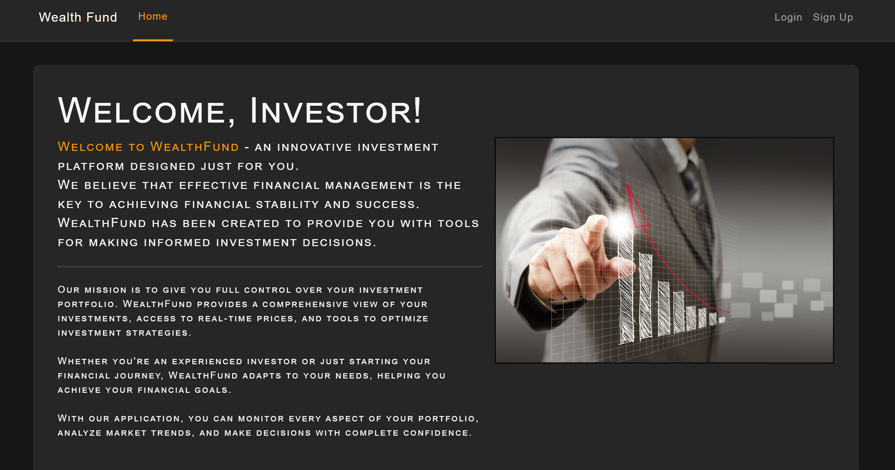
### Registration and login
To use the application, you must register and log in.

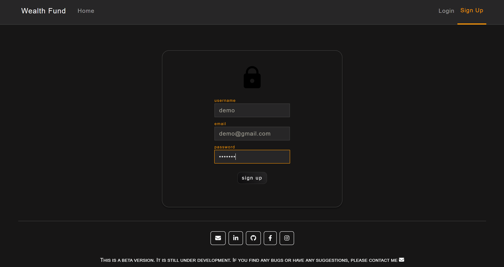
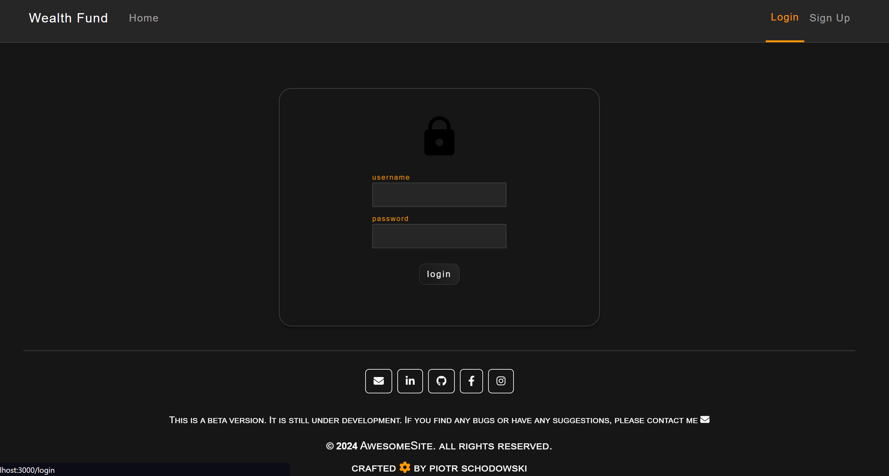
### When you log in, you will see your profile page
Now you have access to all tabs, such as:
> `Wallets`
> `Positions`
> `History`

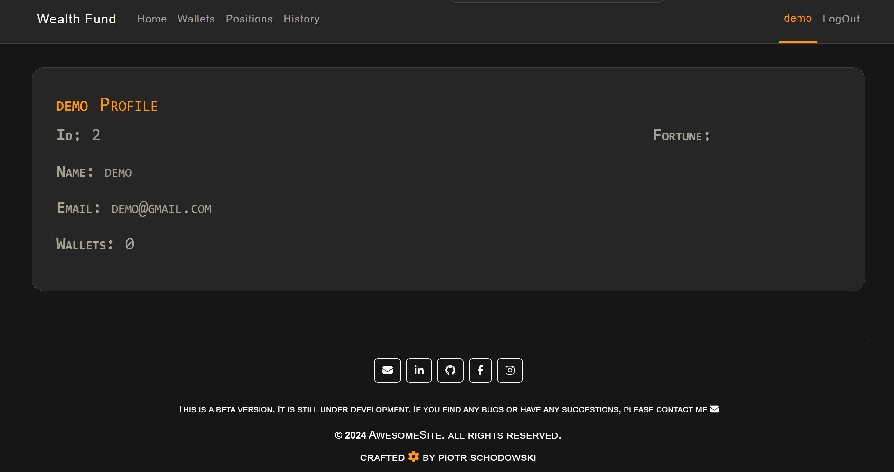
### Next step is to add your wallets 
You can do it in the **wallets** tab:

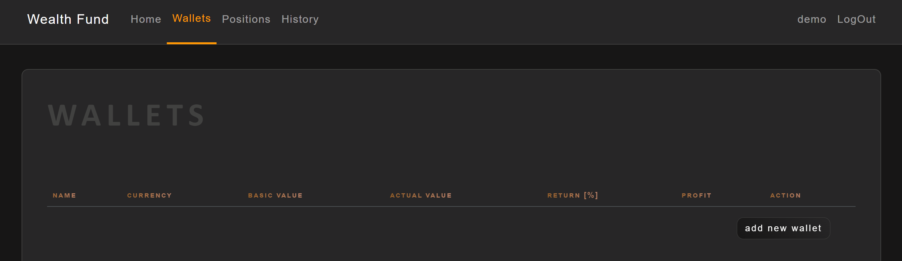

or **position** tab when it is the first your wallet:

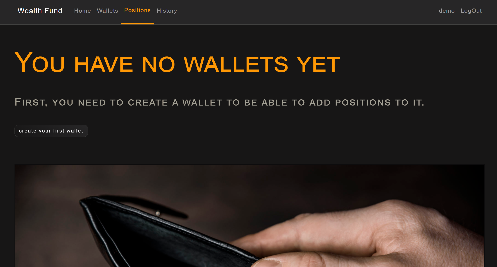

Entry name of wallet and choose currency: 

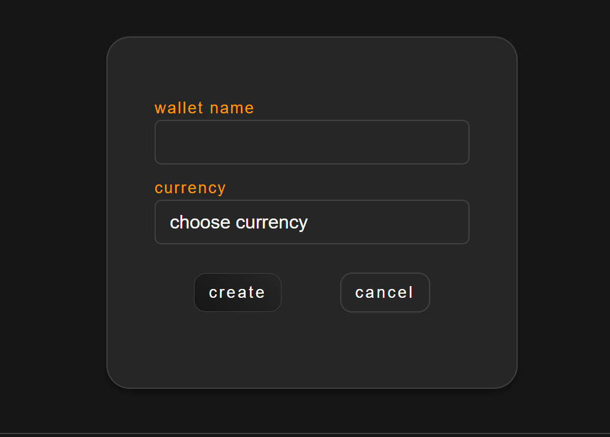

You can add multiple wallets in different currencies:

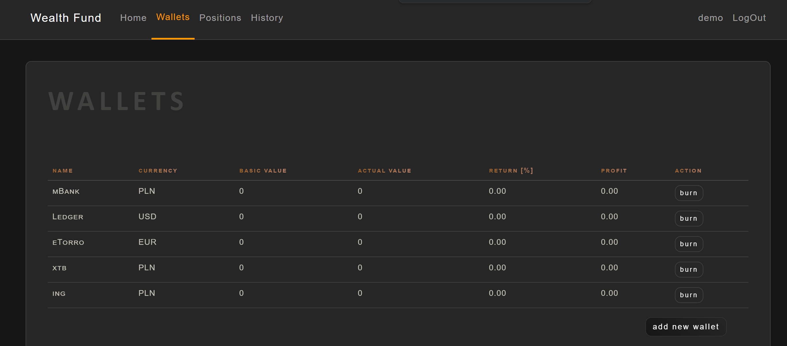

### Add positions
Now you can add positions to your wallets.
You can do it in the **positions** tab:

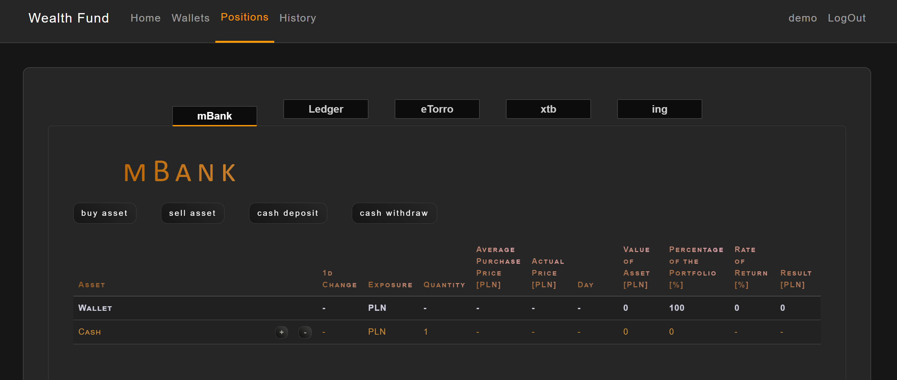

First you have to choose wallet and deposit cash:

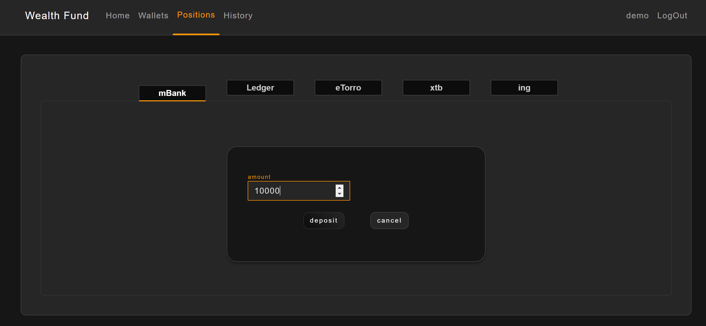
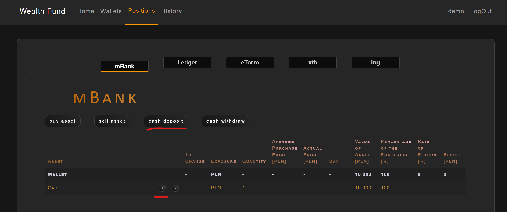

Now, you can add positions, click the **buy asset** or **+** when you would like to increase existing position

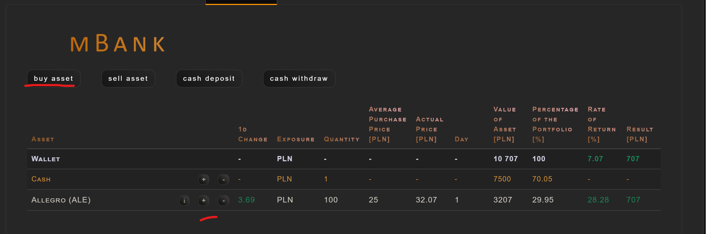
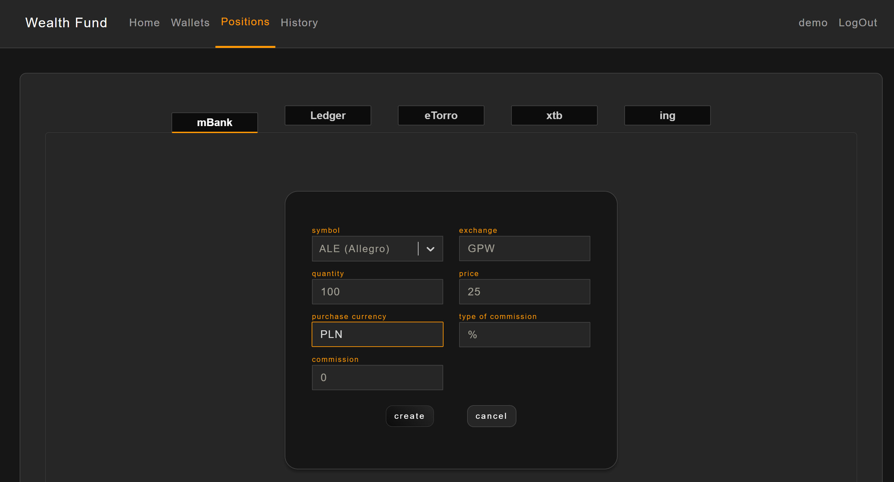

### Watch your positions:

>`on the table:`

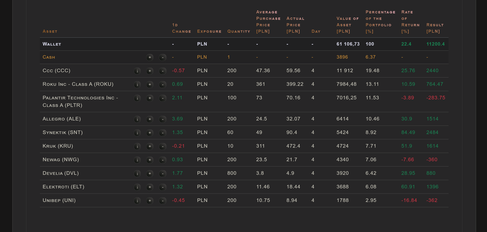

>`on the chart:`

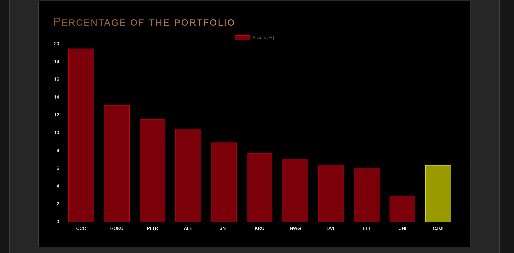

### Watch your portfolios in time:

>`on the table:`

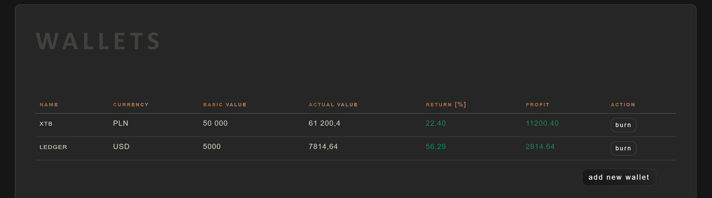

>`on the chart:`

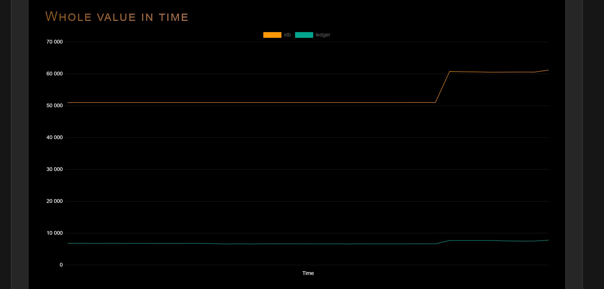

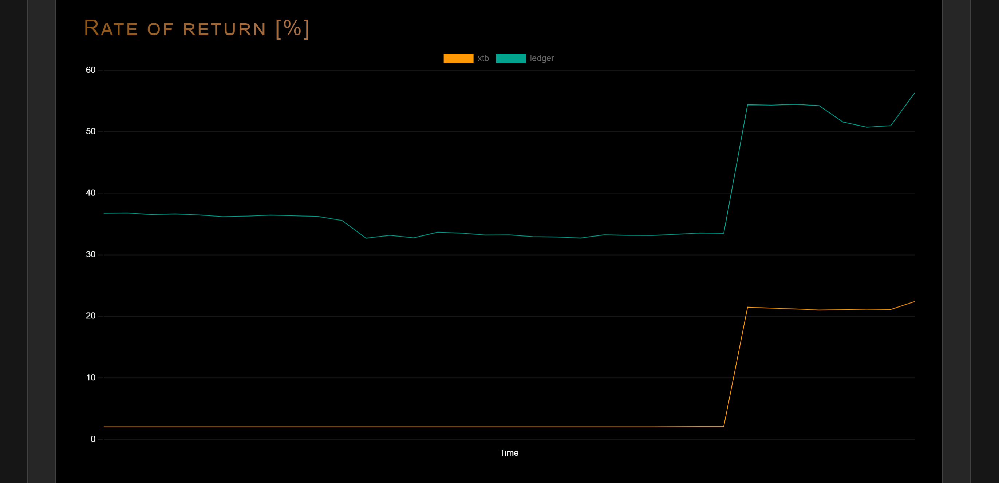

### Watch your history:

and undo when you made mistake

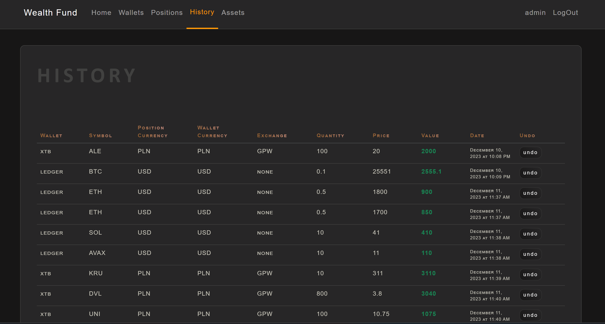

### Watch you profile with information about you fortunes in different currencies:

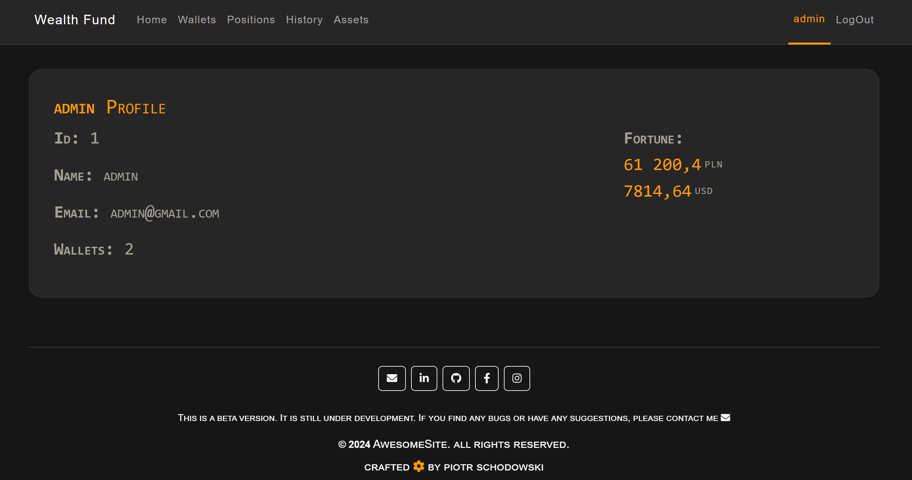

### When you are Admin, you can manage assets in special page !

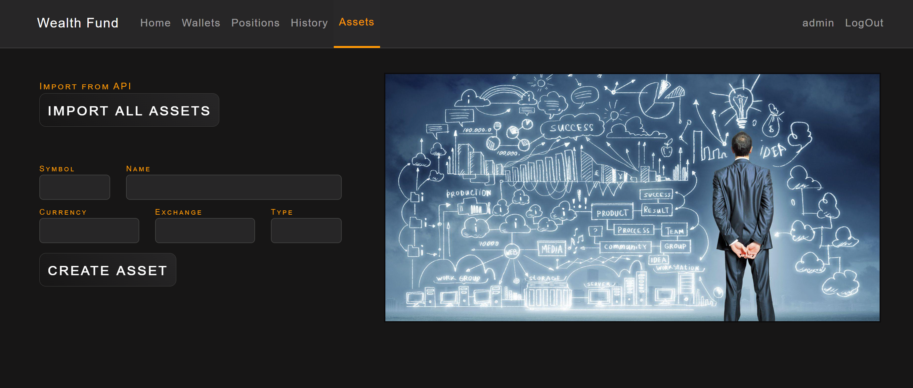

Admin can import assets or create new ones if they are not in the database.

## Thank you for your attention!
If you have any questions, solutions, or ideas, please contact me at: ps.schodowski@gmail.com